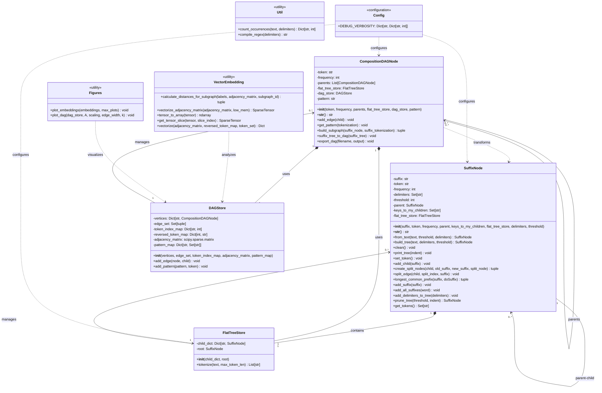
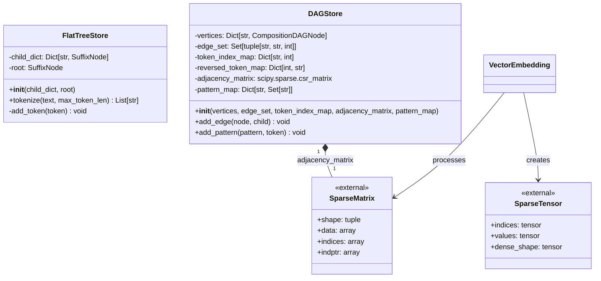
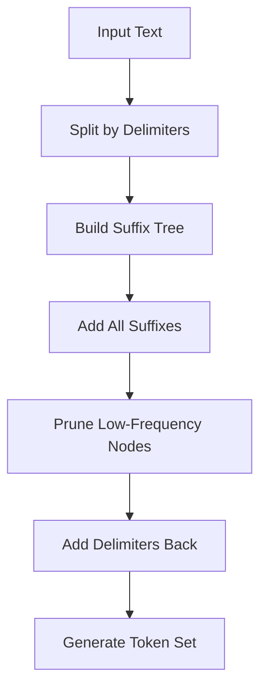
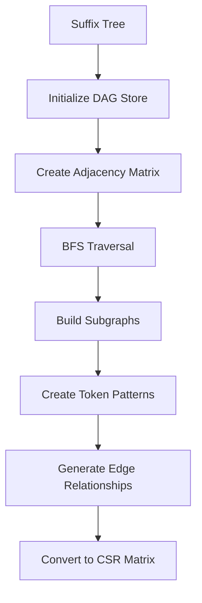
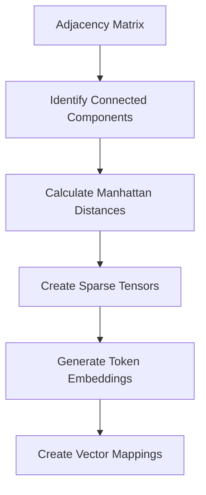

# TokenBN Architecture Documentation

## Overview

TokenBN is a sophisticated text analysis framework that implements advanced tokenization techniques using modified suffix trees and directed acyclic graphs (DAGs). The system transforms raw text into structured token representations with hierarchical relationships, enabling pattern recognition and vector embedding analysis.

## System Architecture

The TokenBN system follows a layered architecture with clear separation of concerns:

1. **Core Data Structures**: Fundamental node classes that represent tokens and their relationships
2. **Storage Management**: Specialized classes for managing graph and tree data structures
3. **Utility Services**: Helper functions for vector operations, visualization, and text processing
4. **Configuration Management**: Centralized debugging and system configuration

## Core Classes and Relationships

### Main Class Diagram



### Storage and Management Classes Detail



## Detailed Class Descriptions

### SuffixNode

The `SuffixNode` class is the core component for building modified suffix trees. It represents individual nodes in the tree structure where each node can contain a suffix of the input text.

**Key Responsibilities:**
- Build and maintain suffix tree structure from input text
- Handle token frequency tracking and pruning
- Manage parent-child relationships in the tree
- Provide tokenization functionality through the flat tree store

**Key Design Patterns:**
- **Composite Pattern**: Nodes can contain other nodes forming a tree structure
- **Factory Method**: `from_text()` class method creates complete suffix trees
- **Strategy Pattern**: Different pruning strategies can be applied

### CompositionDAGNode

The `CompositionDAGNode` class transforms suffix trees into directed acyclic graphs (DAGs) with enhanced compositional relationships.

**Key Responsibilities:**
- Convert suffix trees to DAG representations
- Maintain token composition patterns and relationships
- Build adjacency matrices for graph analysis
- Export graph data for external analysis tools

**Key Design Patterns:**
- **Builder Pattern**: Incrementally constructs complex DAG structures
- **Observer Pattern**: Manages relationships between parent and child nodes
- **Command Pattern**: Encapsulates graph transformation operations

### FlatTreeStore

A specialized storage manager that provides flattened access to tree nodes and tokenization capabilities.

**Key Responsibilities:**
- Maintain a flat dictionary of all tree nodes for efficient access
- Provide tokenization services using the longest-match algorithm
- Manage the relationship between hierarchical tree structure and flat access

### DAGStore

A comprehensive storage system for managing DAG structures, adjacency matrices, and pattern mappings.

**Key Responsibilities:**
- Store and manage DAG vertices and edges
- Maintain sparse adjacency matrices for efficient graph operations
- Track token patterns and their relationships
- Provide graph export capabilities

## System Workflow

### 1. Text Processing Pipeline



### 2. DAG Construction Pipeline



### 3. Vector Embedding Pipeline



## Key Algorithms and Data Structures

### Suffix Tree Construction
- **Algorithm**: Modified suffix tree with frequency tracking
- **Complexity**: O(n²) for construction, O(n) for tokenization
- **Features**: Edge splitting, node pruning, delimiter handling

### Graph Transformation
- **Algorithm**: Breadth-first traversal with subgraph building
- **Complexity**: O(V + E) where V is vertices and E is edges
- **Features**: Pattern recognition, compositional relationship tracking

### Vector Embedding
- **Algorithm**: Manhattan distance calculation with sparse tensor representation
- **Complexity**: O(n³) for full embedding, optimized with connected components
- **Features**: Subgraph processing, memory-efficient sparse operations

## Configuration and Debugging

The system uses a centralized configuration system (`config.py`) that provides granular debugging control:

```python
DEBUG_VERBOSITY = {
    "SuffixNode": {
        "general": -1,      # General operations
        "pruning": 0        # Tree pruning operations
    },
    "DAGNode": -1,          # DAG construction operations
    "FlatTreeStore": 0      # Tokenization operations
}
```

## Utility Services

### Vector Embedding Utilities
- **Distance Calculation**: Manhattan distance for graph nodes
- **Tensor Operations**: Sparse tensor manipulation for memory efficiency
- **Parallel Processing**: Optional multi-threaded processing for large graphs

### Visualization Utilities
- **Embedding Plots**: Heatmap visualization of token embeddings
- **Graph Visualization**: NetworkX-based DAG plotting with customizable layouts
- **Export Functions**: Multiple format support for external analysis

### Text Processing Utilities
- **Regex Compilation**: Efficient delimiter pattern matching
- **Occurrence Counting**: Statistical analysis of delimiter frequencies

## Usage Examples

### Basic Suffix Tree Construction
```python
from tokenBN import SuffixNode

# Create suffix tree from text
suffix_tree = SuffixNode.from_text(
    text="example text with patterns",
    threshold=2,
    delimiters={" ", "\n", "."}
)

# Get all discovered tokens
tokens = suffix_tree.get_tokens()
```

### DAG Construction and Analysis
```python
from tokenBN import CompositionDAGNode, plot_dag

# Convert suffix tree to DAG
dag = CompositionDAGNode()
dag.suffix_tree_to_dag(suffix_tree)

# Visualize the graph
plot_dag(dag.dag_store, A=dag.dag_store.adjacency_matrix)

# Export for external analysis
dag.export_dag("output.csv", "patterns")
```

### Vector Embedding Generation
```python
from tokenBN.utils.vector_embedding import vectorize

# Generate vector embeddings
embeddings = vectorize(
    adjacency_matrix=dag.dag_store.adjacency_matrix,
    reversed_token_map=dag.dag_store.reversed_token_map,
    token_set=suffix_tree.get_tokens()
)
```

## Performance Considerations

### Memory Optimization
- **Sparse Matrices**: Use of scipy.sparse for memory-efficient adjacency matrices
- **Lazy Evaluation**: On-demand tensor slice generation
- **Connected Components**: Process subgraphs independently to reduce memory usage

### Computational Efficiency
- **CSR Matrix Format**: Efficient sparse matrix operations
- **Breadth-First Traversal**: Optimal graph traversal for DAG construction
- **Pruning Strategy**: Early elimination of low-frequency nodes

## Extensibility and Future Enhancements

The architecture is designed for extensibility with clear separation of concerns:

1. **Custom Node Types**: Easy to extend with new node implementations
2. **Alternative Storage**: Pluggable storage backends through composition
3. **Additional Algorithms**: New embedding algorithms can be added to utilities
4. **Export Formats**: Simple addition of new export formats